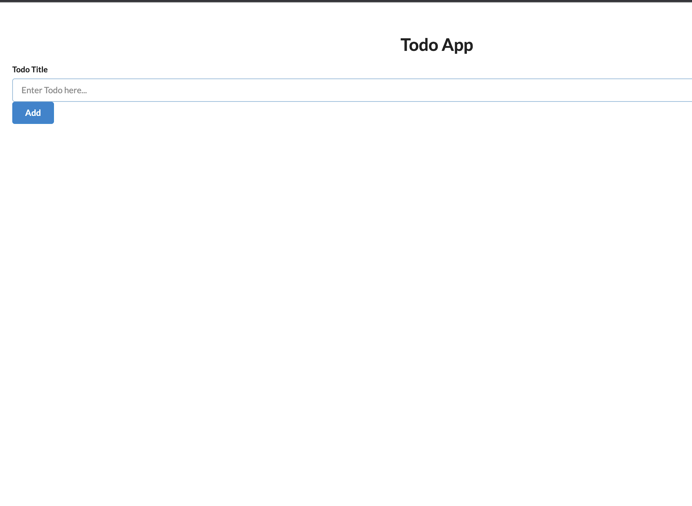
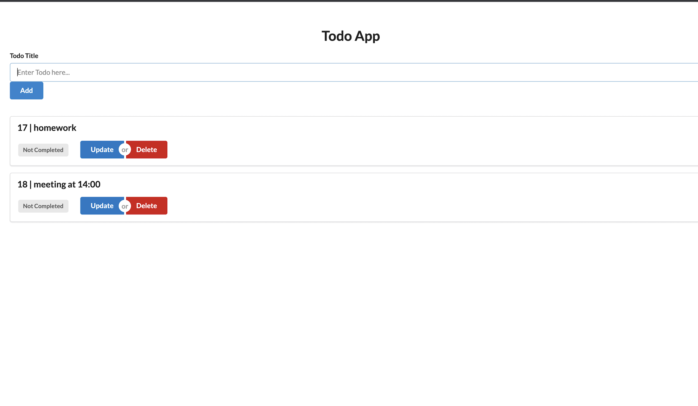
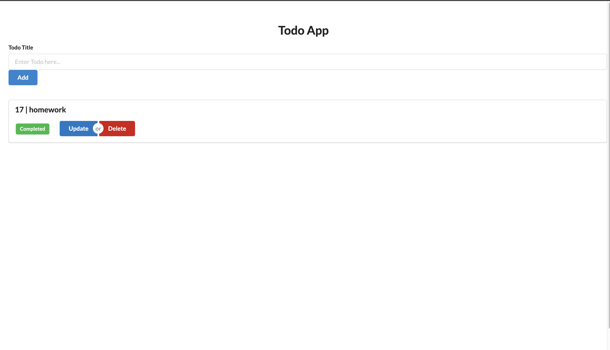
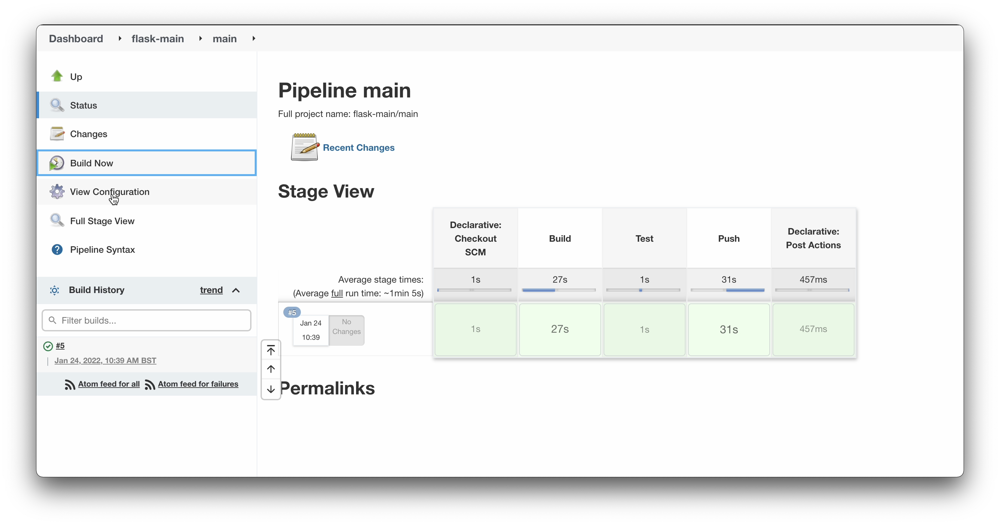

# TODO APP - Final project DFE-Cloud2

#### Project Brief

To create a web application that integrates with a database and demonstrates CRUD functionality.- To utilise containers to host and deploy your application.- To create a continuous integration (CI)/continuous deployment (CD) pipeline that will automatically test, build and deploy your application

### UI of TODO-APP

#### Technologies applied.
Python, Flask, SQL, Docker, Docker-compose Jenkins and Azure.

## A todo app, written in Flask and Python.

### Completing the ToDo task

#### Deleting ToDo Task

A user may add to todo task list, view all  the tasks they have to complete,if the task is completed then just click on that task after clicking it will show as completed and the completed task can be deleted by "Delete Completed Button".

### UI OF TODO-APP

### ADDING THE TODO TASK 

#### COMPLETING AND DELETING THE TODO TASK

### JENKINS PIPELINE

### KUBERNETES
Decided to challenge myself and deployed using kubernetes insted of swarm which is the most powerfull container orchestration tool .. 

The project still in need o some improvements which I will be working through to get more experienced during my devops career .. 
